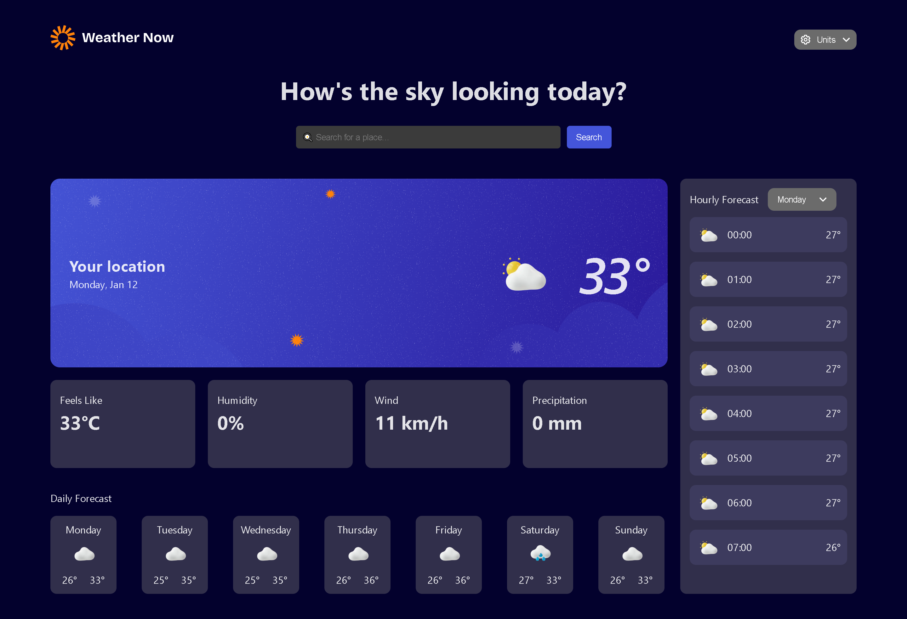

# Weather App

A small, responsive weather web app built with Vite and React. Shows current, hourly, and daily forecasts and includes a service worker for basic offline support.

## Features

- Current weather summary with temperature, humidity, and conditions.
- Hourly forecast cards.
- Daily forecast cards.
- Lightweight skeleton loaders while data loads.
- PWA-friendly service worker (`public/sw.js`).

## Tech Stack

- Frontend: React (JSX) + Vite
- Styling: CSS
- Build & dev: `npm` / Vite

## Repo structure

- `index.html` — app entry
- `src/` — React source files
  - `App.jsx`, `main.jsx`, components in `src/components`
- `public/` — static assets and `sw.js`
- `package.json` — scripts and dependencies

## Getting Started

1. Install dependencies:

```bash
npm install
```

2. Run the development server:

```bash
npm run dev
```

3. Build for production:

```bash
npm run build
```

4. Deploy (project has a `deploy` script; you previously ran `npm run deploy`):

```bash
npm run deploy
```

## Scripts

- `npm run dev` — start dev server
- `npm run build` — build production bundle
- `npm run preview` — locally preview production build
- `npm run deploy` — deploy script (project-specific)


## Contributing

- Open an issue or submit a pull request. Keep changes focused and include brief testing notes.

## License

This project is provided as-is. Add a license file if you plan to open-source it.

---
